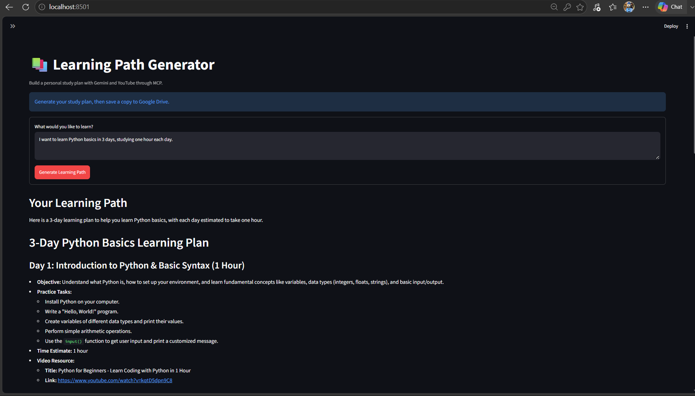
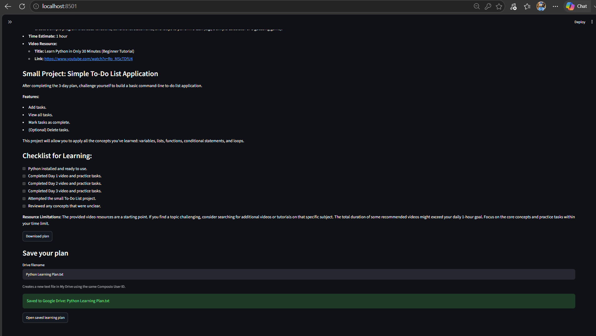

# AI Learning Path Generator 📚

A workshop-based project that generates personalized study plans with YouTube learning resources and saves them to Google Drive.

## Features

- Generates day-by-day learning objectives and practice tasks.
- Finds YouTube learning resources through MCP.
- Includes a small project and learning checklist.
- Downloads study plans as Markdown.
- Saves generated plans to Google Drive.

## Technologies

Python · Streamlit · Google Gemini · LangGraph · Composio · Model Context Protocol (MCP)

## How It Works

1. Enter a learning goal and study duration.
2. The app connects to YouTube tools through a Composio MCP session.
3. Gemini generates a structured learning plan.
4. Review the plan and download it or save it to Google Drive.

## Screenshots

### Learning Goal Input

### Generated Learning Plan

## My Extensions

With AI assistance, I adapted the workshop starter to:

- Use Composio sessions instead of Pipedream URLs.
- Save the displayed plan through a separate Google Drive action.
- Display the final response without intermediate agent messages.
- Add Markdown downloads, input validation, and error handling.

## Project Status

Learning-plan generation and Google Drive saving were tested locally.

This repository currently contains a project showcase. Source code is not included while redistribution permission for the workshop starter is being clarified.

Generated recommendations and video relevance should be reviewed before use.

## Acknowledgments

Based on the NxtWave MCP Workshop starter project:
https://github.com/revanthgopi-nw/mcp-learning-path-demo

Extended by Mythri Gaddam with AI assistance.
